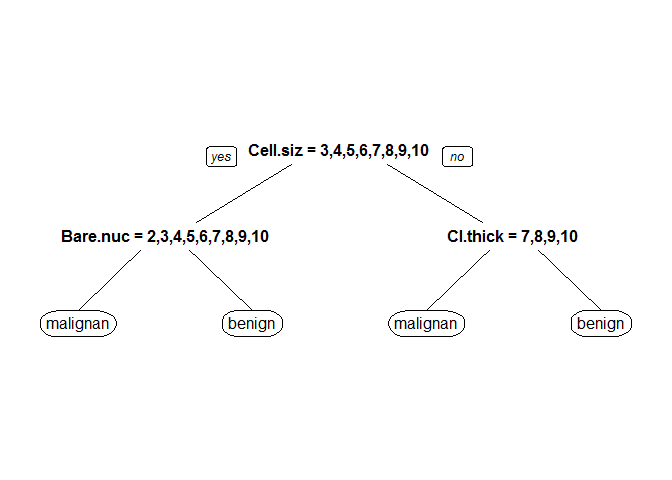

乳癌預測模型
================

資料前處理
==========

資料解釋
--------

此資料來源為UCI Machine Learning Repository。

資料內共紀錄699個病人資料，用來預測病人的乳房腫瘤是良性還是陰性，裡頭包含了11個參數，例如細胞大小等等...。分類結果為二元分類，包刮陰性(malignant)與良性(benign)。

資料讀取
--------

``` r
#install.packages("mlbench")
library(mlbench)
```

    ## Warning: package 'mlbench' was built under R version 3.2.5

``` r
data(BreastCancer)
str(BreastCancer)
```

    ## 'data.frame':    699 obs. of  11 variables:
    ##  $ Id             : chr  "1000025" "1002945" "1015425" "1016277" ...
    ##  $ Cl.thickness   : Ord.factor w/ 10 levels "1"<"2"<"3"<"4"<..: 5 5 3 6 4 8 1 2 2 4 ...
    ##  $ Cell.size      : Ord.factor w/ 10 levels "1"<"2"<"3"<"4"<..: 1 4 1 8 1 10 1 1 1 2 ...
    ##  $ Cell.shape     : Ord.factor w/ 10 levels "1"<"2"<"3"<"4"<..: 1 4 1 8 1 10 1 2 1 1 ...
    ##  $ Marg.adhesion  : Ord.factor w/ 10 levels "1"<"2"<"3"<"4"<..: 1 5 1 1 3 8 1 1 1 1 ...
    ##  $ Epith.c.size   : Ord.factor w/ 10 levels "1"<"2"<"3"<"4"<..: 2 7 2 3 2 7 2 2 2 2 ...
    ##  $ Bare.nuclei    : Factor w/ 10 levels "1","2","3","4",..: 1 10 2 4 1 10 10 1 1 1 ...
    ##  $ Bl.cromatin    : Factor w/ 10 levels "1","2","3","4",..: 3 3 3 3 3 9 3 3 1 2 ...
    ##  $ Normal.nucleoli: Factor w/ 10 levels "1","2","3","4",..: 1 2 1 7 1 7 1 1 1 1 ...
    ##  $ Mitoses        : Factor w/ 9 levels "1","2","3","4",..: 1 1 1 1 1 1 1 1 5 1 ...
    ##  $ Class          : Factor w/ 2 levels "benign","malignant": 1 1 1 1 1 2 1 1 1 1 ...

資料前處理
----------

留下沒有缺值的資料，並把無關病情的資料拿掉(ID)

``` r
BreastCancerC<-BreastCancer[complete.cases(BreastCancer),
!names(BreastCancer) %in% c("Id")] 
c(nrow(BreastCancer),nrow(BreastCancerC))
```

    ## [1] 699 683

### 將資料隨機分為訓練組與測試組

隨機將2/3的資料分到訓練組（Test==F），剩下1/3為測試組（Test==T)

``` r
BreastCancerC$Test<-F 
BreastCancerC[
    sample(1:nrow(BreastCancerC),nrow(BreastCancerC)/3),
    ]$Test<-T 
c(sum(BreastCancerC$Test==F),sum(BreastCancerC$Test==T)) 
```

    ## [1] 456 227

可得訓練組案例數為456測試組案例數為227

預測模型建立
------------

### 模型建立

由於變數多，且多為連續變項，而輸出為二元類別變項，故選擇決策樹演算法來建立模型。

``` r
#install.packages("rpart")
library(rpart)
BreastCancerC$Class<-factor(BreastCancerC$Class,levels=c("malignant","benign"))
set.seed(1000)          
fit<-rpart(Class~.,data=BreastCancerC[BreastCancerC$Test==F,]) 
#install.packages("rpart.plot")
library(rpart.plot)
```

    ## Warning: package 'rpart.plot' was built under R version 3.2.5

``` r
summary(fit)
```

    ## Call:
    ## rpart(formula = Class ~ ., data = BreastCancerC[BreastCancerC$Test == 
    ##     F, ])
    ##   n= 456 
    ## 
    ##           CP nsplit rel error    xerror       xstd
    ## 1 0.81578947      0 1.0000000 1.0000000 0.06622662
    ## 2 0.04605263      1 0.1842105 0.2105263 0.03588657
    ## 3 0.01973684      2 0.1381579 0.1842105 0.03372678
    ## 4 0.01000000      3 0.1184211 0.1907895 0.03428364
    ## 
    ## Variable importance
    ##       Cell.size      Cell.shape     Bare.nuclei    Epith.c.size 
    ##              21              17              16              15 
    ##     Bl.cromatin Normal.nucleoli    Cl.thickness 
    ##              15              15               1 
    ## 
    ## Node number 1: 456 observations,    complexity param=0.8157895
    ##   predicted class=benign     expected loss=0.3333333  P(node) =1
    ##     class counts:   152   304
    ##    probabilities: 0.333 0.667 
    ##   left son=2 (166 obs) right son=3 (290 obs)
    ##   Primary splits:
    ##       Cell.size       splits as  RRLLLLLLLL, improve=152.3179, (0 missing)
    ##       Cell.shape      splits as  RRRLLLLLLL, improve=146.6229, (0 missing)
    ##       Bl.cromatin     splits as  RRRLLLLLLL, improve=138.1430, (0 missing)
    ##       Bare.nuclei     splits as  RRRLLLLLLL, improve=138.0680, (0 missing)
    ##       Normal.nucleoli splits as  RRLLLLLLLL, improve=131.3440, (0 missing)
    ##   Surrogate splits:
    ##       Cell.shape      splits as  RRRLLLLLLL, agree=0.921, adj=0.783, (0 split)
    ##       Epith.c.size    splits as  RRLLLLLLLL, agree=0.899, adj=0.723, (0 split)
    ##       Bl.cromatin     splits as  RRRLLLLLLL, agree=0.893, adj=0.705, (0 split)
    ##       Bare.nuclei     splits as  RRLLLLLLLL, agree=0.888, adj=0.693, (0 split)
    ##       Normal.nucleoli splits as  RRLLLLLLLL, agree=0.884, adj=0.681, (0 split)
    ## 
    ## Node number 2: 166 observations,    complexity param=0.04605263
    ##   predicted class=malignant  expected loss=0.126506  P(node) =0.3640351
    ##     class counts:   145    21
    ##    probabilities: 0.873 0.127 
    ##   left son=4 (147 obs) right son=5 (19 obs)
    ##   Primary splits:
    ##       Bare.nuclei   splits as  RLLLLLLLLL, improve=13.346970, (0 missing)
    ##       Cell.shape    splits as  RRLLLLLLLL, improve=13.288250, (0 missing)
    ##       Bl.cromatin   splits as  RRLLLLLLLL, improve=11.145080, (0 missing)
    ##       Cell.size     splits as  RRRLLLLLLL, improve=11.059880, (0 missing)
    ##       Marg.adhesion splits as  RRLLLLLLLL, improve= 8.706716, (0 missing)
    ##   Surrogate splits:
    ##       Cell.shape  splits as  RLLLLLLLLL, agree=0.922, adj=0.316, (0 split)
    ##       Bl.cromatin splits as  RLLLLLLLLL, agree=0.922, adj=0.316, (0 split)
    ## 
    ## Node number 3: 290 observations,    complexity param=0.01973684
    ##   predicted class=benign     expected loss=0.02413793  P(node) =0.6359649
    ##     class counts:     7   283
    ##    probabilities: 0.024 0.976 
    ##   left son=6 (7 obs) right son=7 (283 obs)
    ##   Primary splits:
    ##       Cl.thickness    splits as  RRRRRRLLLL, improve=6.833195, (0 missing)
    ##       Normal.nucleoli splits as  RRLL-LL---, improve=4.236197, (0 missing)
    ##       Bl.cromatin     splits as  RRR-L-L---, improve=3.725899, (0 missing)
    ##       Bare.nuclei     splits as  RRRRL-L--L, improve=3.281681, (0 missing)
    ##       Epith.c.size    splits as  RRRLLLLLLL, improve=2.025544, (0 missing)
    ##   Surrogate splits:
    ##       Normal.nucleoli splits as  RRRL-RL---, agree=0.986, adj=0.429, (0 split)
    ##       Epith.c.size    splits as  RRRRLLLLLL, agree=0.983, adj=0.286, (0 split)
    ##       Bare.nuclei     splits as  RRRRR-R--L, agree=0.979, adj=0.143, (0 split)
    ##       Mitoses         splits as  RR-LR-RR-,  agree=0.979, adj=0.143, (0 split)
    ## 
    ## Node number 4: 147 observations
    ##   predicted class=malignant  expected loss=0.05442177  P(node) =0.3223684
    ##     class counts:   139     8
    ##    probabilities: 0.946 0.054 
    ## 
    ## Node number 5: 19 observations
    ##   predicted class=benign     expected loss=0.3157895  P(node) =0.04166667
    ##     class counts:     6    13
    ##    probabilities: 0.316 0.684 
    ## 
    ## Node number 6: 7 observations
    ##   predicted class=malignant  expected loss=0.2857143  P(node) =0.01535088
    ##     class counts:     5     2
    ##    probabilities: 0.714 0.286 
    ## 
    ## Node number 7: 283 observations
    ##   predicted class=benign     expected loss=0.007067138  P(node) =0.620614
    ##     class counts:     2   281
    ##    probabilities: 0.007 0.993

``` r
prp(fit)
```

<!-- -->

模型說明
--------

由上述參數可知，以決策樹建立模型預測乳房腫瘤是否為陰性或良性，經最佳化後，所用到的參數為上圖的決策樹所示

預測模型驗證
============

``` r
#install.packages("caret")
library(caret)
```

    ## Warning: package 'caret' was built under R version 3.2.5

    ## Loading required package: lattice

    ## Loading required package: ggplot2

    ## Warning: package 'ggplot2' was built under R version 3.2.5

``` r
MinePred<-predict(fit,newdata = BreastCancerC[BreastCancerC$Test==T,],type = "class")
sensitivity(MinePred,BreastCancerC[BreastCancerC$Test==T,]$Class)
```

    ## [1] 0.8552632

``` r
specificity(MinePred,BreastCancerC[BreastCancerC$Test==T,]$Class)
```

    ## [1] 0.9735099

``` r
posPredValue(MinePred,BreastCancerC[BreastCancerC$Test==T,]$Class)
```

    ## [1] 0.942029

``` r
negPredValue(MinePred,BreastCancerC[BreastCancerC$Test==T,]$Class)
```

    ## [1] 0.9303797

使用病患資料來預測乳房腫瘤是否為陰性或良性，以決策樹模型預測是否為陰性，可得：敏感度、特異性、陽性預測率、陰性預測率。
